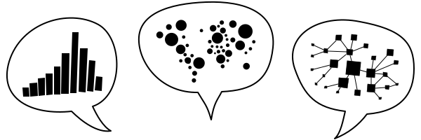

# Data in Dialogue
## An Interactive Atlas of Critical Data Visualization

Data visualizations are not just windows into the world, but communicative acts that frame reality from particular vantage points. They can raise questions, provoke reflection, and open up complex issues for debate, but they can also mislead, manipulate, or marginalize. This atlas holds an expanding body of work about the power dynamics at play when visualizing data. It is an attempt to keep tabs on projects and publications that show how data visualizations can foster conversations about intricate matters.

### Navigation

This atlas is designed for wandering. Watch your step, though: it is still under construction. 

There are several ways to move around:

- **Search** across all text fields (top right)
- **Shuffle** for random entries (bottom right)
- **Switch** between views (bottom left)
- **Subscribe** to the <a href="https://infovis.fh-potsdam.de/atlas/feed.xml" type="application/rss+xml">RSS feed</a> for updates

### Scope

The featured work asks how interaction can encourage participation, how visualizations can support sensemaking, and how aesthetics can convey meaning. Some entries open up cultural collections and historical records to new readings. Others trace how conventions for representing data take shape, including tools and textbooks through which these conventions are taught and passed on. There are also entries that question the viability of data visualization altogether.

Each entry includes an abstract or short description, along with a teaser image, both taken from the work itself where available. These excerpts are quoted for the purpose of learning and scholarly exchange, with full credit and links to the original sources. The entries are tagged with keywords and are linked to one another if there is a direct influence. There is no claim to completeness. If you know of something that should be added, notice that something needs fixing, or hold the rights to an item whose entry should be changed or removed, please <a href="mailto:marian.doerk@fh-potsdam.de">email me</a>.

### Colophon

Data in Dialogue was conceived and is maintained by <a href="https://mariandoerk.de">Marian Dörk</a>. The interface concept is based on the ideas behind the <a href="#i:doerk2011information">Information Flaneur</a>, <a href="#i:doerk2014monadic">Monadic Exploration</a>, and <a href="#i:brueggemann2020fold">The Fold</a>. All text is set in <a href="https://www.brailleinstitute.org/freefont/">Atkinson Hyperlegible Next</a>. The search relies on the <a href="https://tartarus.org/martin/PorterStemmer/">Porter stemmer</a>, and the map uses <a href="https://umap-learn.readthedocs.io/">UMAP</a> to place entries with similar sets of keywords close to each other.

While the design and curation are my own, the <a href="https://github.com/uclab-potsdam/data-in-dialogue">code</a> of the interface was written with Claude (Opus 4.5–5.5). It began as a personal experiment in prototyping with a large language model. Since then, I have become increasingly uneasy about the immense energy these tools consume and the human labor they make invisible.

This webpage does not track you. It sets no cookies and stores nothing about your visit.

<a href="https://www.fh-potsdam.de/impressum" target="_blank">Imprint</a> &nbsp; <a href="https://www.fh-potsdam.de/en/privacy" target="_blank">Privacy</a>